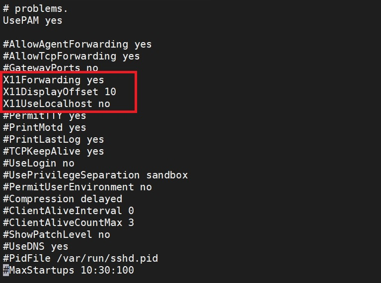

# How to Access Display for Remote OCI Compute Linux

## How to Export GUI Display for OCI Compute Linux

The easist way is to use MobaTerm (https://mobaxterm.mobatek.net/download.html). You can, however, use other ways such as VNC too. This guide will explain how to export display with MobaTerm. The rest of the guide assume you have MobaTerm installed locally (Home edition is sufficient).

Now we configure SSH to enable GUI export by run the following command from SSH:  
```
sudo sed -i 's/^#X11UseLocalhost yes/X11UseLocalhost no/' /etc/ssh/sshd_config
sudo sed -i 's/^#X11DisplayOffset 10/X11DisplayOffset 10/' /etc/ssh/sshd_config
sudo more /etc/ssh/sshd_config
```
Make sure 3 parameter started with X11 all not in comment mode (if in comment usually started with #)

  

Then after checking done we need to restart ssh service to make the changes take effects:
```
sudo systemctl restart sshd.service
sudo yum -y install xauth xterm libXtst
```
Then we need to close current ssh connection and open again and we can verify if the GUI export is working, by typing xterm, suppose it will show another SSH terminal. Also make sure we open the firewall and SElinux, we can do like this:
```
sudo firewall-cmd --permanent --zone=public --add-port=22/tcp
sudo firewall-cmd --reload
sudo sed -i 's/^SELINUX=enforcing/SELINUX=permissive/' /etc/selinux/config
```
Beside that do not forget to check Security List in the Oracle Cloud VCN, make sure to allow port 22.

## How to Enable VNC Server for OCI Compute Linux

Another alternative is to install [TigerVNC viewer](https://github.com/TigerVNC/tigervnc/releases) get the binary from there and install tigervnc, this tools will give you desktop look and feel from the remote linux into your machine/bastion. 

To enable this we need to do some configuration on the remote machine:
```
sudo yum install nmap vnc-server -y
sudo yum groups install "Server with GUI" --skip-broken -y
vncserver
```
The last command will start the service to enable Desktop environment for the specific user that run it (opc) just input the password when prompted, this password will be used as authentication for VNC service.
```
You will require a password to access your desktops.

Password:
Verify:
Would you like to enter a view-only password (y/n)?
A view-only password is not used

New 'weblogic1:1 (opc)' desktop is weblogic1:1

Creating default startup script /home/opc/.vnc/xstartup
Creating default config /home/opc/.vnc/config
Starting applications specified in /home/opc/.vnc/xstartup
Log file is /home/opc/.vnc/weblogic1:1.log
```
Next we need to check on which port that being used for VNC Service, it can be done using this command:
```
namp -Pn localhost
```
That will show:
```
Starting Nmap 6.40 ( http://nmap.org ) at 2020-05-16 07:17 GMT
Nmap scan report for localhost (127.0.0.1)
Host is up (0.0012s latency).
Other addresses for localhost (not scanned): 127.0.0.1
Not shown: 995 closed ports
PORT     STATE SERVICE
22/tcp   open  ssh
111/tcp  open  rpcbind
631/tcp  open  ipp
5901/tcp open  vnc-1
6001/tcp open  X11:1
```
From above we know that vnc-1 use port 5901 so we need to open the firewall:
```
sudo firewall-cmd --permanent --zone=public --add-port=5901/tcp
sudo firewall-cmd --reload
sudo sed -i 's/^SELINUX=enforcing/SELINUX=permissive/' /etc/selinux/config
```
Beside that do not forget to check Security List in the Oracle Cloud VCN, make sure to allow port 5901.
