# How to Provision VM Compute Linux for Oracle WebLogic Server

## Pre-requisite

This guide assumes you have already provisioned appropriate VCN, Compartment, and any other requirements.

Before provisioning VM, you need to generate a RSA key pair for the compute so that later on you can SSH to the compute with the key pair. You can refer to here https://www.oracle.com/webfolder/technetwork/tutorials/obe/cloud/javaservice/JCS/JCS_SSH/create_sshkey.html.

The rest of the guide assume you have generated a key pair named: id_rsa, with its private key in id_rsa.ppk and public key in id_rsa.pub.

## Provision VM

Now login to your Oracle cloud tenancy from http://cloud.oracle.com with your tenancy ID, username and password.  

Click on the Menu on the top left hand corner and select 'Compute' -> 'Instances'. (Note that it's a good practice to create separate compartment and VCN for multitenancy purpose, this part is not included in the guide here)  

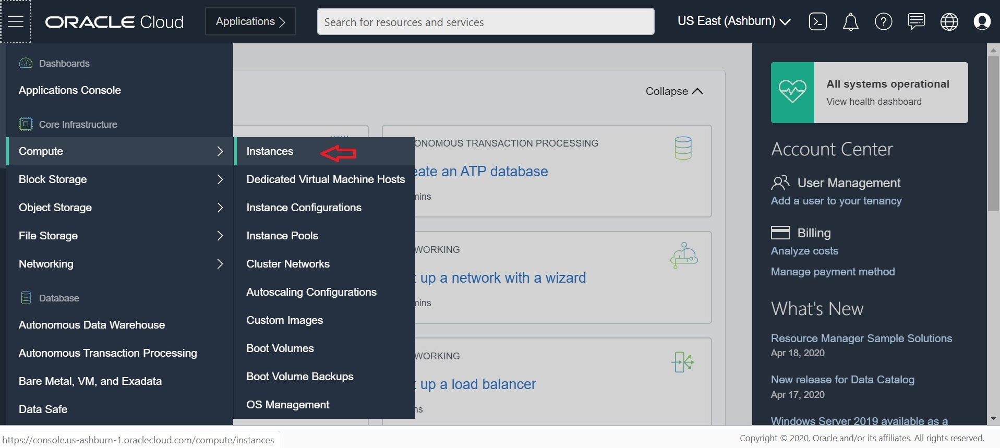  

Click on 'Create Instance' below:  

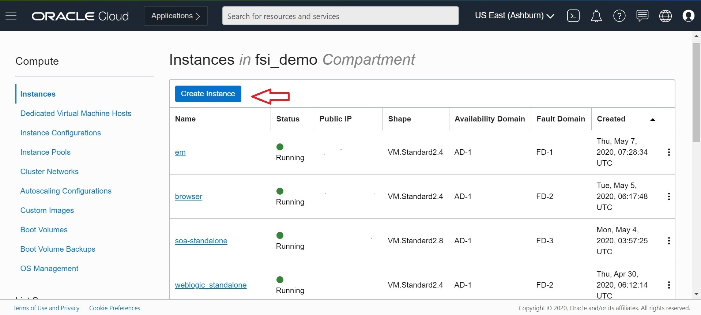  

Name the new compute instance as 'weblogic1' and leave the default image as Oracle Linux:

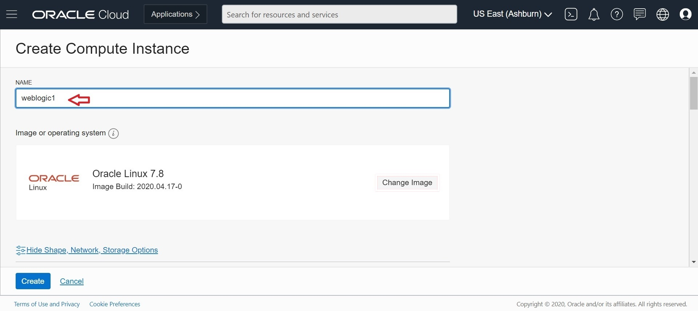

Scroll down to change the Shape from default to VM.Standard 2.4 with 4 OCPU for optimal performance for development environment. For performance testing, choose a shape that matches the production environment. Click on 'Change Shape':

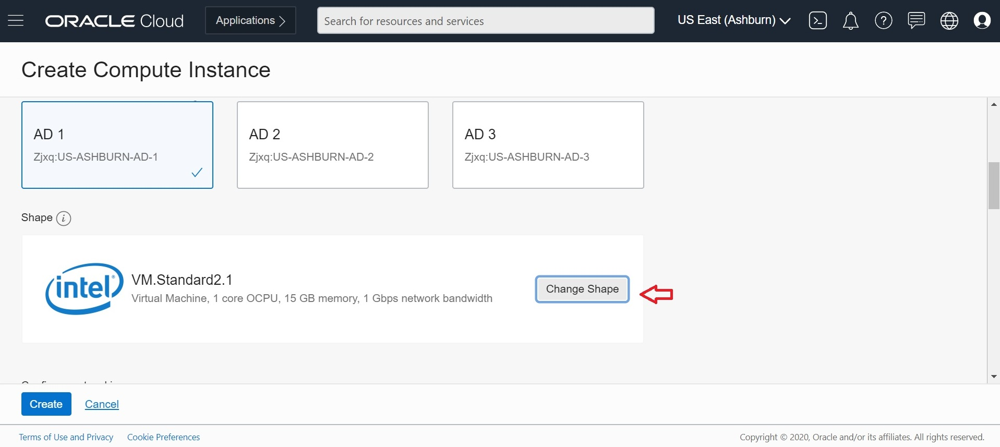  

Choose VM.Standard2.4 as shown and click 'Select Shape':  

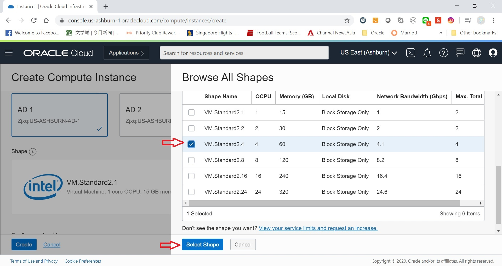  

Validate the network setting and ensure that you are on a public subnet as highlighted. This is to ensure a public IP will be generated for the VM so that you can SSH directly later. If you wish to use private subnet instead, note that you need to set up additional Bastion host in order to access the VM later, which is not covered in this guide.  

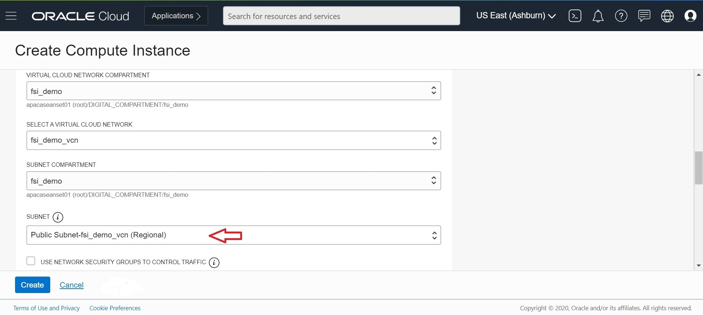  

Scroll down to ensure the VM will be assigned a public IP as follows:  

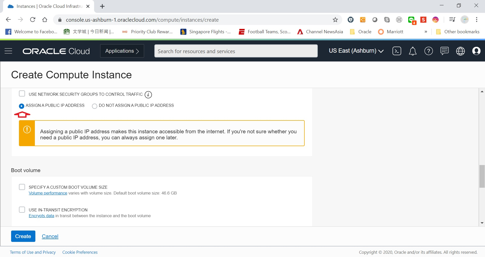  

Scroll down to specify the public key that you generated earlier. Ensure the public key is loaded as shown, and click on 'Create' to provision the VM.  

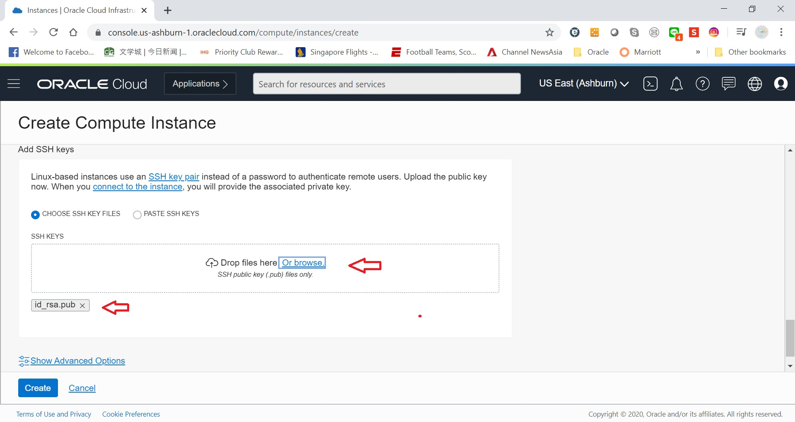  

Wait for VM provision to complete, and review the VM details, capture the public IP of the VM for SSH access.  (I have mask the actual IP, you should get this on your VM details screen)  

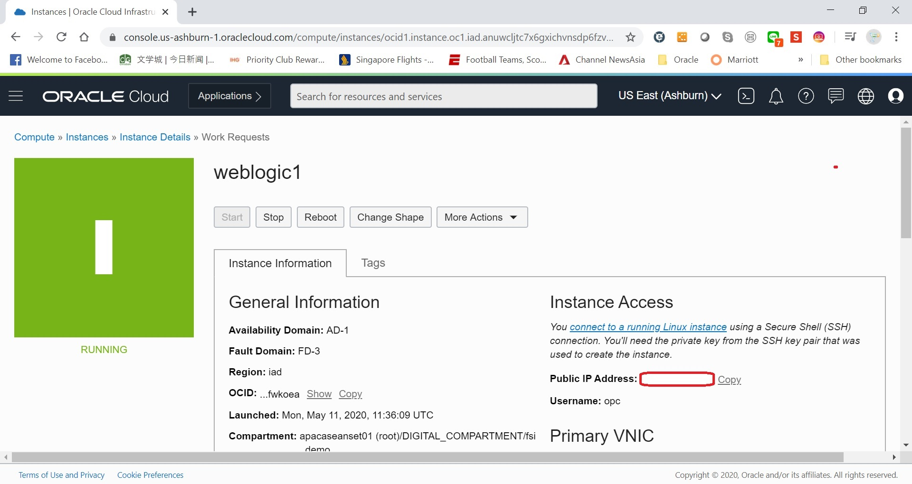  

A lot of customer out there is using putty, while the rest of the demo will be using MobaTerm for its ease of X11 Display, I have included option steps here to setup access via Putty in case you are using Putty.  

To test the VM, open Putty and enter the IP of the VM:  

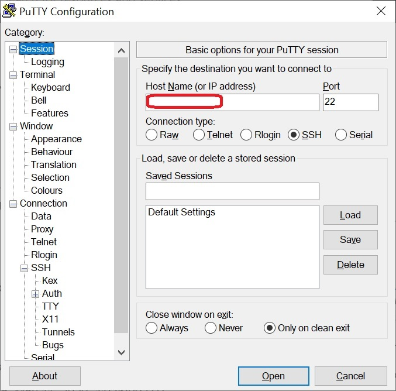  

From Putty Menu on the left, navigate to 'Connection' -> 'SSH' -> 'Auth', and specify the private key you generated earlier as shown, and click 'Open':

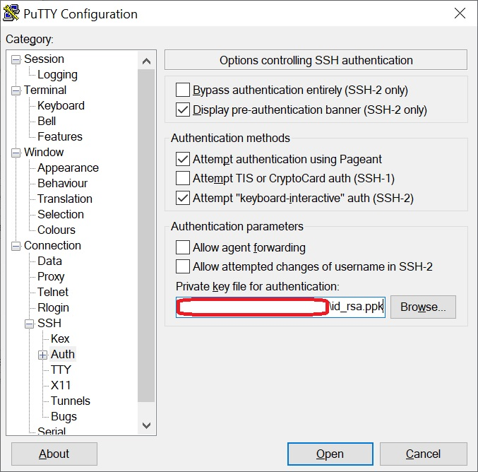  

Click on 'Yes':  

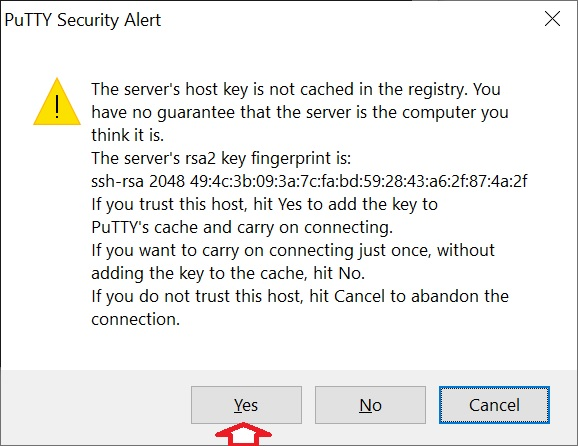  

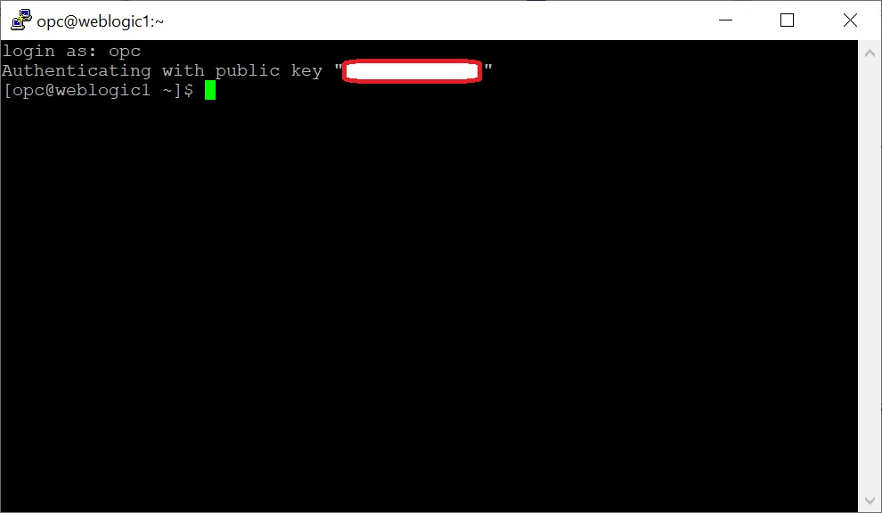  

That's all you need with Putty.  

With MobaTerm, the steps are very similar and the SSH private key configuration is here instead:  

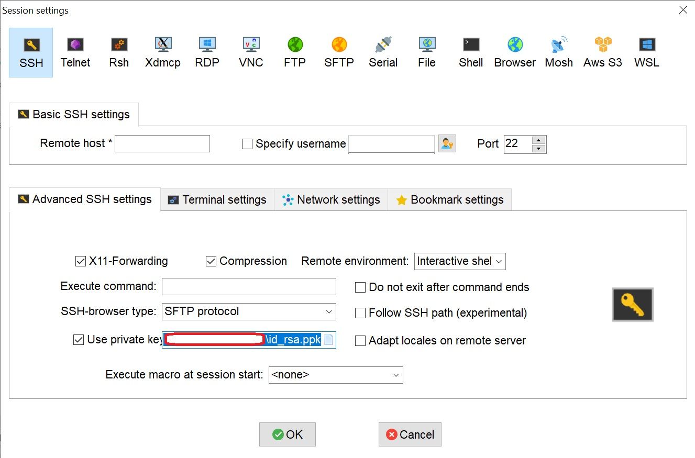  
