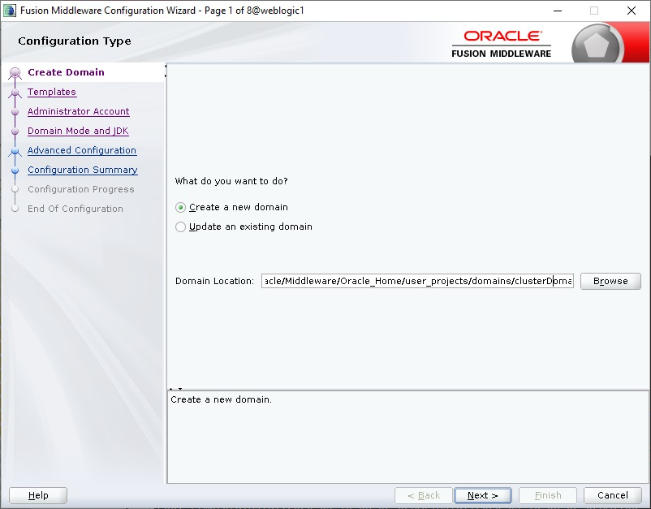
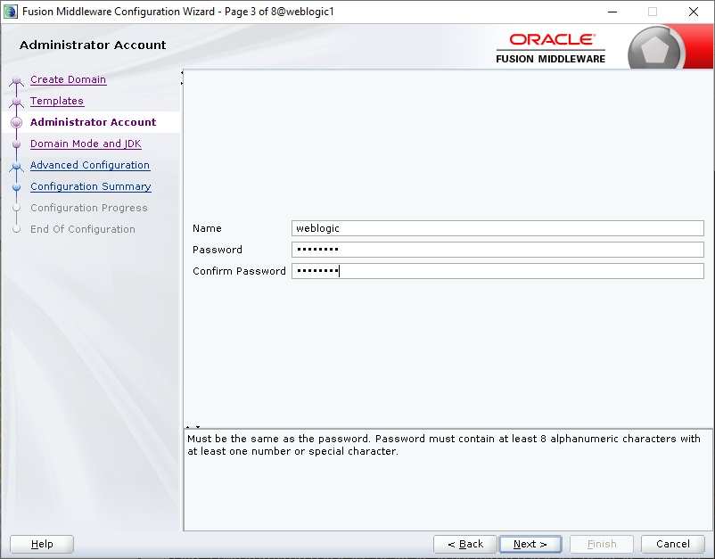
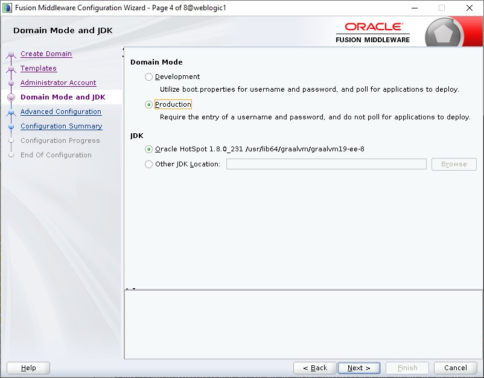
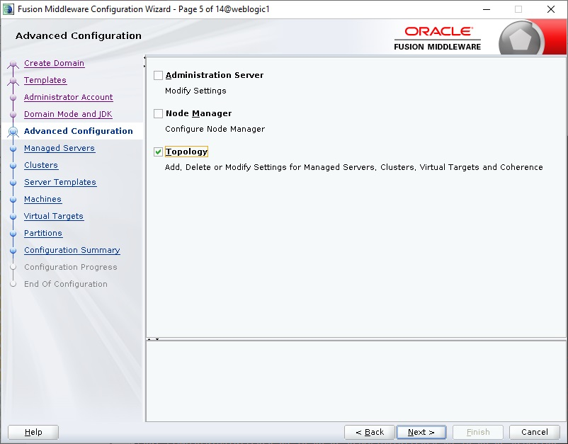
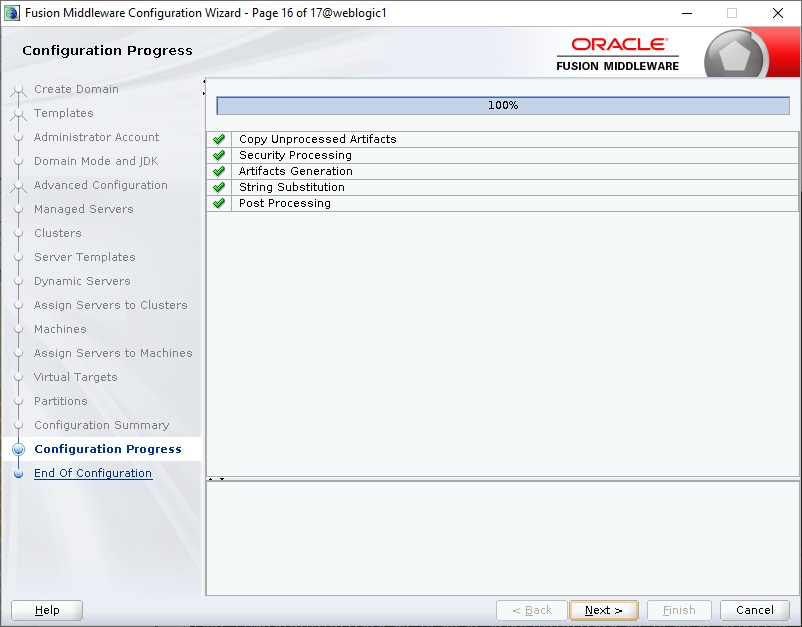
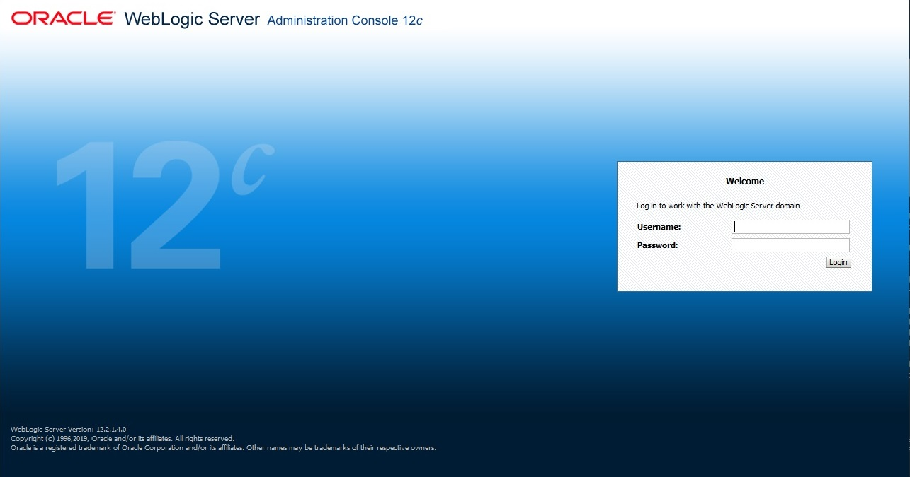
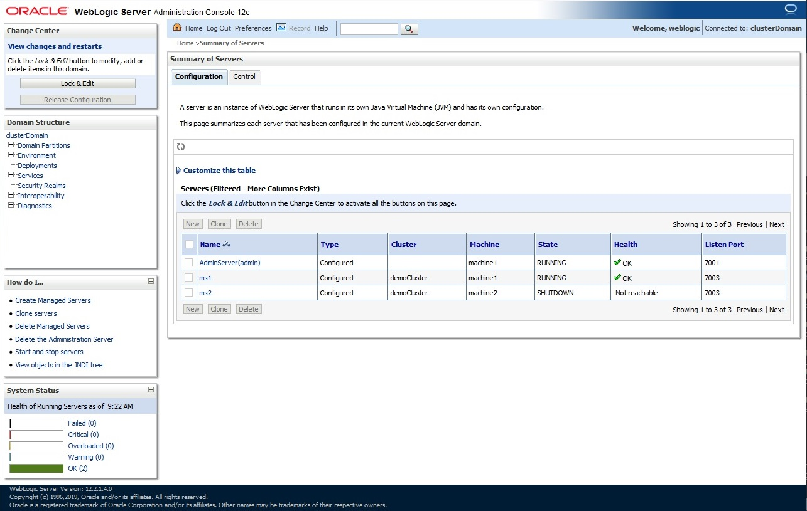
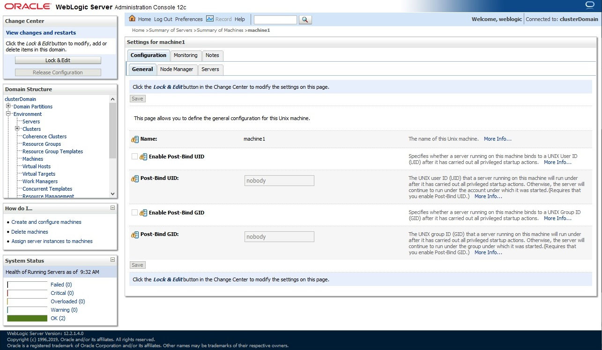
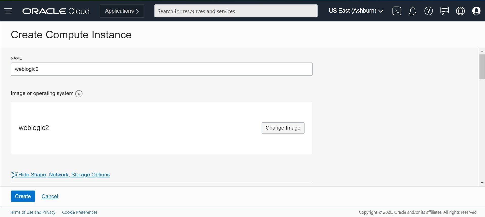
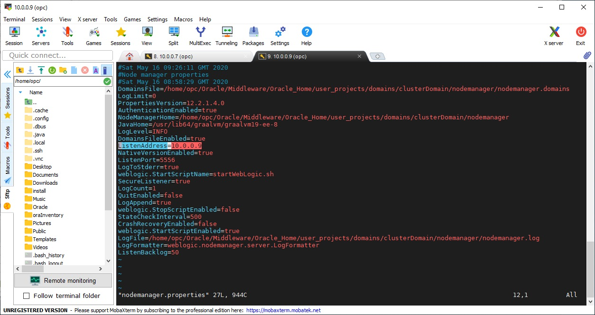

# How to Setup CLuster for Oracle WebLogic Server on OCI Compute Linux

This guide leverages on OCI features to setup a on-prem WebLogic environment on OCI (Oracle Cloud Infrastructure). This is typically applicable if you are using Oracle cloud for development, functional testing or performance testing of on-prem WebLogic applications. This guide assumes you have basic WebLogic Administration knowledge and is familiar with WebLogic Console and Linux.

## Overview

In the following steps, you will be setting up a weblogic cluster that spans across two OCI Compute. The steps you will be performing includes:

- Configure a new clustered WebLogic Domain with 2 managed servers  
- Configure node manager for the first VM  
- Clone the boot volume of the first VM to be the boot volume of the second VM, and provision second VM (weblogic2) using the boot volume cloned  
- Prepare the second VM to join WebLogic Cluster  

## Step 1: Configure Cluster WebLogic Domain

Start Domain Configuration Wizard from SSH by running :  
```
cd
cd Oracle/Middleware/Oracle_Home/oracle_common/common/bin
./config.sh
```
Select create new domain and change the default domain name to your preferred domain name. In this example, we are using 'clusterDomain' as shown. Click 'Next' to proceed:  

  

Click 'Next' to proceed:

  

Enter admin user name, password and click 'Next':  

  

For optimal performance, choose 'Production' mode and default JDK, click 'Next':  

  

Click on the checkbox next to 'Topology' in order to configure cluster, and click 'Next':  

  

Click 'Add' button twice to create two managed server, and configure its names as ms1 and ms2 respectively. In ms1, use the dropdown to pick the local IP within OCI as listen address, while for ms2, manually enter a similar IP temporary as we don't have the new IP yet for second compute. Set port number for both server as 7003, and click 'Next':  

  

Click 'Add' button to create a new cluster and enter name as 'demoCluster', and click 'Next':  

  

Click 'Next':  

  

Click 'Next' as we are not using dynamic cluster for this setup:  

  

Click on 'ms1'/'ms2' on the left and select 'demoCluster' on the right, the right arrow button will be enabled. Click on the right arrow to add both ms1 and ms2 into the cluster as shown, and click 'Next':  

  

Click on "Unix Machine" and use the 'Add' button to add two machines as shown, and click 'Next':  

  

Use the arrow to move the servers from left to right under machine1 and machine2 as shown:  

 

Click Next:

 

Click Next:

 

In summary screen, click 'Create' to proceed with domain creation:  

  

Upon completion, click 'Next' to proceed:  

  

Click 'Finish' to exit the wizard.  

  

## Step 2: Open Firewall for Port 7001 and 7003

In order to access the admin console remotely, we need to open up firewall for port 7001 (admin server). Should you need to access the managed servers too, you need to use the same procedure to open port 7003.  

From SSH, run this:
```
sudo firewall-cmd --permanent --zone=public --add-port=7001/tcp  
sudo firewall-cmd --permanent --zone=public --add-port=7003/tcp  
sudo firewall-cmd --reload  
```
From OCI Cloud Console showing details of the compute weblogic1, click on the subnet name as shown:  

  

In the subnet details page, scroll down and click on the name of the default security list as shown:  

  

Click on 'Add Ingress Rule':  

  

Enter source CIDR as '0.0.0.0/0' and destination port as '7001', and click 'Add Ingress Rules'. This will add rule in the subnet to allow public Internet to have access to port 7001 to all servers within the subnet.  

  

## Step 3: Start WebLogic Server

Before we start the WebLogic server we need to create directory to store boot.properties files that store WebLogic Admin and its password:
```
cd
cd Oracle/Middleware/Oracle_Home/user_projects/domains/clusterDomain
mkdir -p servers/AdminServer/security
vi servers/AdminServer/security/boot.properties
```
File content should be as follows:  
```
username=weblogic  
password=\<selected password during domain configuration wizard\>  
```
Now we can start the WebLogic Server:
```
cd
cd Oracle/Middleware/Oracle_Home/user_projects/domains/clusterDomain
nohup ./startWebLogic.sh > admin.log &
```
To track the progress, run command below:  
```
tail -f admin.log
```
Wait untill you see this message below, this indicate WebLogic Admin Server is up:

  

To access the admin server from browser, open browser with the URL: http://<public_ip>:7001/console  

  

This shows WebLogic Server is now up and running.  

To start the first managed server with script, follow the similar steps above to create the same boot.properties file: 
```
cd
cd Oracle/Middleware/Oracle_Home/user_projects/domains/clusterDomain
mkdir -p servers/ms1/security
cp servers/AdminServer/security/boot.properties servers/ms1/security/boot.properties
```
We also going to create the same file for ms2 for cluster purpose:
```
cd
cd Oracle/Middleware/Oracle_Home/user_projects/domains/clusterDomain
mkdir -p servers/ms2/security
cp servers/AdminServer/security/boot.properties servers/ms2/security/boot.properties
```
And run the start script belwo: from <domain_home>/bin: nohup ./startManagedWebLogic ms1 localhost:7001 > server1.log &  
```
cd
cd Oracle/Middleware/Oracle_Home/user_projects/domains/clusterDomain
cd bin
nohup ./startManagedWebLogic.sh ms1 localhost:7001 > server1.log &
```
Monitor the log server1.log to make sure ms1 is up. You can see this from WebLogic Console:  

  

## Step 4: Configure Node Manager for First VM  

To start node manager, do this: change working directory to <domain_home>/bin and run this: nohup ./startNodeManager.sh &  
```
cd
cd Oracle/Middleware/Oracle_Home/user_projects/domains/clusterDomain
cd bin
nohup ./startNodeManager.sh > node1.log &
```
Monitor file node1.log to see the progress:
```
Domain name mappings:

clusterDomain -> /home/opc/Oracle/Middleware/Oracle_Home/user_projects/domains/clusterDomain

<May 16, 2020 9:31:12 AM GMT> <INFO> <12.2.1.4.0>
<May 16, 2020 9:31:12 AM GMT> <INFO> <Server Implementation Class: weblogic.nodemanager.server.NMServer$ClassicServer.>
<May 16, 2020 9:31:12 AM GMT> <INFO> <Secure socket listener started on port 5556, host /10.0.0.7>
```
To verify the node manager is working, navigate from WebLogic Console: <domain_name> -> Environment -> Machines, and click on Machine1:  
  

Click 'Monitoring' tab above and verify the machine is reachable.  

  

With node manager working, you can also stop/start managed server ms1 from WebLogic Console directly. We are done with the first VM and can now move on to the next step.

## Step 5: Disbale SSL Hostname Verification for Managed Server and Node Manager

We need to disable SSL Hostname verification because the SSL certificate is self signed, to do that open the WebLogic console: <domain_name> -> Environment -> Servers. First we do for AdminServer then later we repeat for ms1 and ms2:


Next we need to edit startNodeManager.sh script to disable SSL hostname verification and we do it by:
```
cd
cd Oracle/Middleware/Oracle_Home/user_projects/domains/clusterDomain
cd bin
sed -i 's/^JAVA_OPTIONS=\"\${JAVA_OPTIONS} -Dweblogic.RootDirectory=\${DOMAIN_HOME} \"/JAVA_OPTIONS=\"\${JAVA_OPTIONS} -Dweblogic.RootDirectory=\${DOMAIN_HOME} -Dweblogic.nodemanager.sslHostNameVerificationEnabled=false\"/' startNodeManager.sh
```
## Step 6: Clone Boot Volume of First VM into Second VM

We need to shutdown the first VM before cloning, go to the details screen of the first VM from Cloud Console and click on 'Stop' to shutdown the VM:  

  

Click on 'Stop Instance' to confirm:  

  

Once the instance is down, click on 'Boot volume' from the left menu:  

  

Click on the link to access boot volume as follows:  

  

From the boot volume details screen, click on 'Boot Volume Clones' and click 'Create Clone':  

  

Enter name 'weblogic2' and click on 'Create Clone':  

  

Wait for the clone to be available, and select 'Create Instance' from the right menu as follows:  

  

Enter name as 'weblogic2' as follows:  

  

For subsequent fields, follow the same setting as weblogic1 above. Proceed to provision weblogic2 by clicking 'Create'. Wait for instance provisioning to complete.  

  

Take note of the public IP and internal IP of the new VM weblogic2.  

Go back to Instances details for weblogic1 and start up weblogic1 too.  

  

## Step 7: Prepare Second VM to join WebLogic Cluster

SSH back to the first VM weblogic1 and start Admin Server & Node Manager again using same instruction earlier in this guide.  

SSH to the second VM weblogic2 and change working directory to <domain_home>.  
```
cd
cd Oracle/Middleware/Oracle_Home/user_projects/domains/clusterDomain
cd nodemanager
vi nodemanager.properties
```
Open the file nodemanager.properties under <domain_home>/nodemanager, and change ListenAddress to the internal IP of weblogic2:  

  

Open local firewall in weblogic2 by running:  
```
sudo firewall-cmd --permanent --zone=public --add-port=5556/tcp  
sudo firewall-cmd --reload
```
Start node manager following same instruction in first VM weblogic1 above.  

Login to the weblogic console again (http://\<public_ip_of_weblogic1\>:7001/console) again and nagivate to Machines list and go to macine2 and Monitoring:  

  

No WebLogic Cluster is now ready for use.

 
