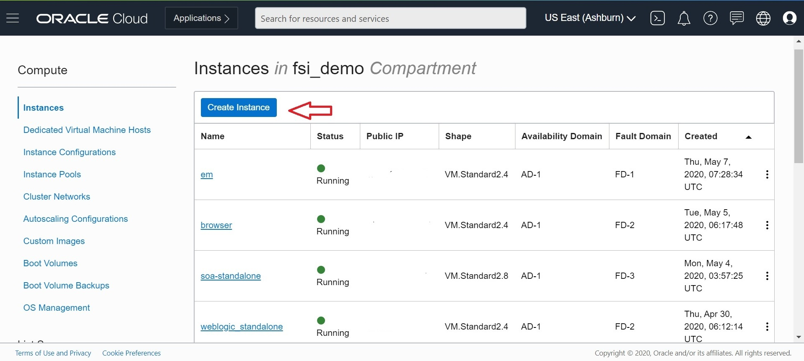
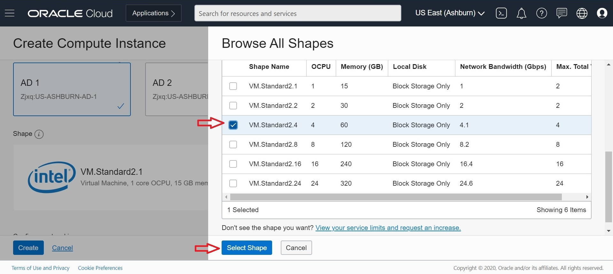
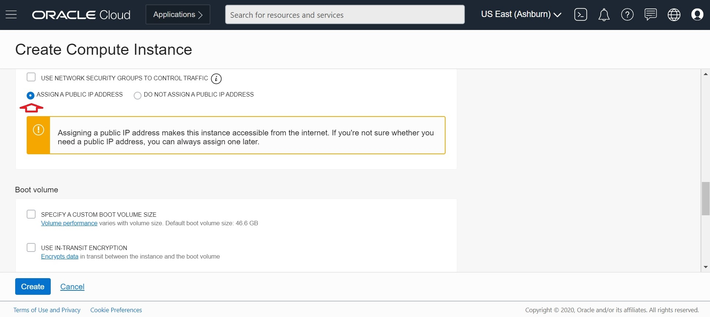
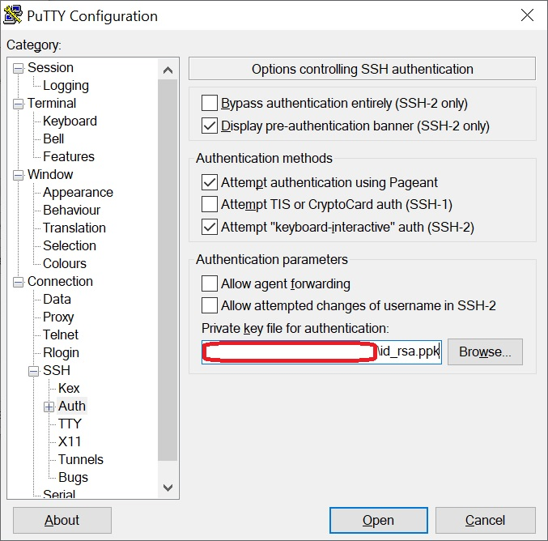

# WebLogic Cluster Setup Guide on OCI

This guide leverages on OCI features to setup a on-prem WebLogic environment on OCI (Oracle Cloud Infrastructure). This is typically applicable if you are using Oracle cloud for development, functional testing or performance testing of on-prem WebLogic applications.

## Overview

In the following steps, you will be setting up a weblogic cluster that spans across two OCI Compute. The steps you will be performing includes:

- Provision first VM (weblogic1) on OCI using standard images  
- Install WebLogic Binary on the first VM  
- Configure a new clustered WebLogic Domain with 2 managed servers  
- Configure node manager for the first VM  
- Clone the boot volume of the first VM to be the boot volume of the second VM  
- Provision second VM (weblogic2) using the boot volume cloned  
- Prepare the second VM to join WebLogic Cluster  
- Bring up and test WebLogic Cluster across two VMs  

## Step 1: Provision first VM weblogic1 on OCI using standard images

Before provisioning VM, you need to generate a RSA key pair for the compute so that later on you can SSH to the compute with the key pair.  

*** TODO ***  

Now login to your Oracle cloud tenancy from http://cloud.oracle.com with your tenancy ID, username and password.  

Click on the Menu on the top left hand corner and select 'Compute' -> 'Instances'. (Note that it's a good practice to create separate compartment and VCN for multitenancy purpose, this part is not included in the guide here)  

  

Click on 'Create Instance' below:  

  

Name the new compute instance as 'weblogic1' and leave the default image as Oracle Linux:  

  

Scroll down to change the Shape from default to VM.Standard 2.4 with 4 OCPU for optimal performance for development environment. For performance testing, choose a shape that matches the production environment. Click on 'Change Shape':

  

Choose VM.Standard2.4 as shown and click 'Select Shape':  

  

Validate the network setting and ensure that you are on a public subnet as highlighted. This is to ensure a public IP will be generated for the VM so that you can SSH directly later. If you wish to use private subnet instead, note that you need to set up additional Bastion host in order to access the VM later, which is not covered in this guide.  

  

Scroll down to ensure the VM will be assigned a public IP as follows:  

  

Scroll down to specify the public key that you generated earlier. Ensure the public key is loaded as shown, and click on 'Create' to provision the VM.  

  

Wait for VM provision to complete, and review the VM details, capture the public IP of the VM for SSH access.  (I have mask the actual IP, you should get this on your VM details screen)  

  

To test the VM, open Putty and enter the IP of the VM:  

  

From Putty Menu on the left, navigate to 'Connection' -> 'SSH' -> 'Auth', and specify the private key you generated earlier as shown, and click 'Open':

  

Click on 'Yes':  

  

You are in and ready to move to the next step!  

  

## Step 2: Install WebLogic Binary on the first VM

Follow installation guide [here](weblogic_standalone_setup_on_oci.md)

## Step 3: Configure Cluster WebLogic Domain
## Step 4: Configure Node Manager for First VM
## Step 5: Clone Boot Volume of First VM into Second VM
## Step 6: Provision Second VM weblogic2
## Step 7: Prepare Second VM to join WebLogic Cluster
## Step 8: Bring Up and Test WebLogic Cluster
