# WebLogic Cluster Setup Guide on OCI

This guide leverages on OCI features to setup a on-prem WebLogic environment on OCI (Oracle Cloud Infrastructure). This is typically applicable if you are using Oracle cloud for development, functional testing or performance testing of on-prem WebLogic applications.

## Overview

In the following steps, you will be setting up a weblogic cluster that spans across two OCI Compute. The steps you will be performing includes:

- Provision first VM (weblogic1) on OCI using standard images  
- Install WebLogic Binary on the first VM  
- Configure a new clustered WebLogic Domain with 2 managed servers  
- Configure node manager for the first VM  
- Clone the boot volume of the first VM to be the boot volume of the second VM  
- Provision second VM (weblogic2) using the boot volume cloned  
- Prepare the second VM to join WebLogic Cluster  
- Bring up and test WebLogic Cluster across two VMs  

## Step 1: Provision first VM weblogic1 on OCI using standard images

Before provisioning VM, you need to generate a RSA key pair for the compute so that later on you can SSH to the compute with the key pair.  

*** TODO ***  

Now login to your Oracle cloud tenancy from http://cloud.oracle.com with your tenancy ID, username and password.  

Click on the Menu on the top left hand corner and select 'Compute' -> 'Instances'. (Note that it's a good practice to create separate compartment and VCN for multitenancy purpose, this part is not included in the guide here)  

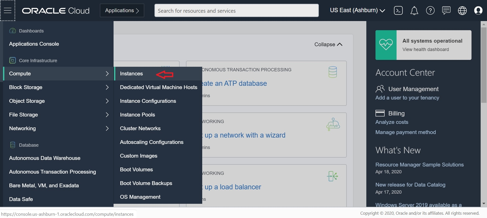  

Click on 'Create Instance' below:  

  

Name the new compute instance as 'weblogic1' and leave the default image as Oracle Linux:  

  

Scroll down to change the Shape from default to VM.Standard 2.4 with 4 OCPU for optimal performance for development environment. For performance testing, choose a shape that matches the production environment. Click on 'Change Shape':

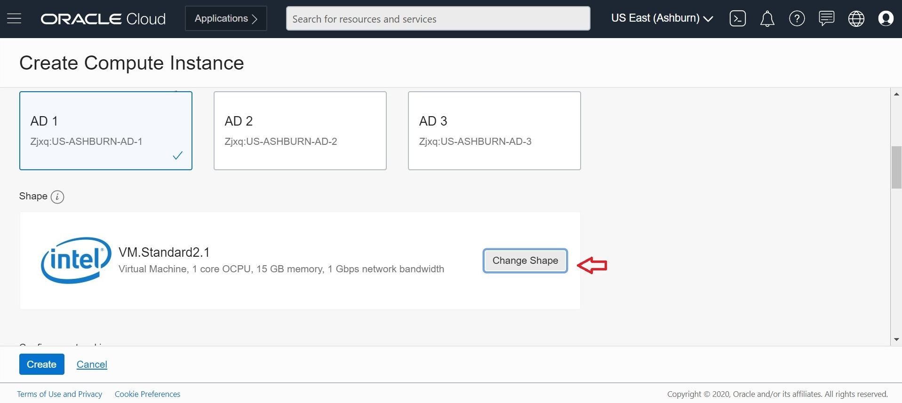  

Choose VM.Standard2.4 as shown and click 'Select Shape':  

  

Validate the network setting and ensure that you are on a public subnet as highlighted. This is to ensure a public IP will be generated for the VM so that you can SSH directly later. If you wish to use private subnet instead, note that you need to set up additional Bastion host in order to access the VM later, which is not covered in this guide.  

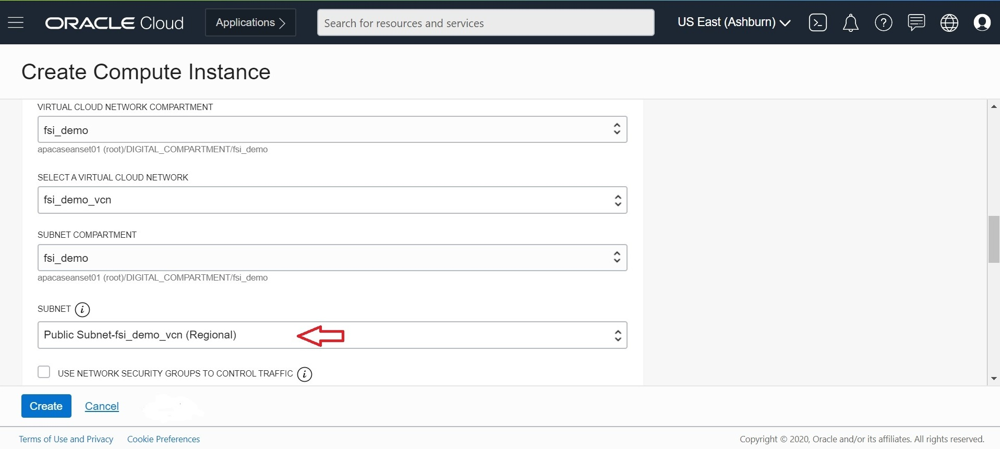  

Scroll down to ensure the VM will be assigned a public IP as follows:  

  

Scroll down to specify the public key that you generated earlier. Ensure the public key is loaded as shown, and click on 'Create' to provision the VM.  

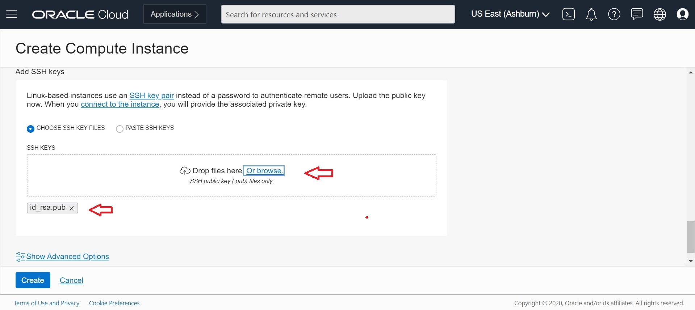  

Wait for VM provision to complete, and review the VM details, capture the public IP of the VM for SSH access.  (I have mask the actual IP, you should get this on your VM details screen)  

  

A lot of customer out there is using putty, while the rest of the demo will be using MobaTerm for its ease of X11 Display, I have included option steps here to setup access via Putty in case you are using Putty.  

To test the VM, open Putty and enter the IP of the VM:  

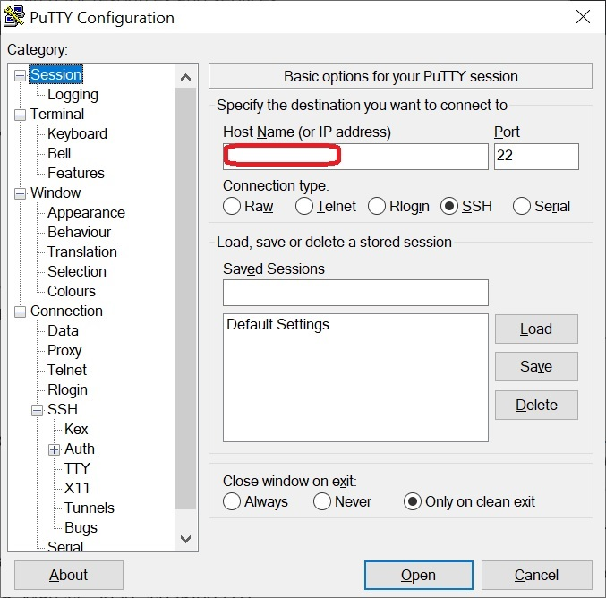  

From Putty Menu on the left, navigate to 'Connection' -> 'SSH' -> 'Auth', and specify the private key you generated earlier as shown, and click 'Open':

  

Click on 'Yes':  

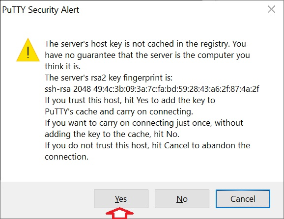  

  

That's all you need with Putty.  

With MobaTerm, the steps are very similar and the SSH private key configuration is here instead:  

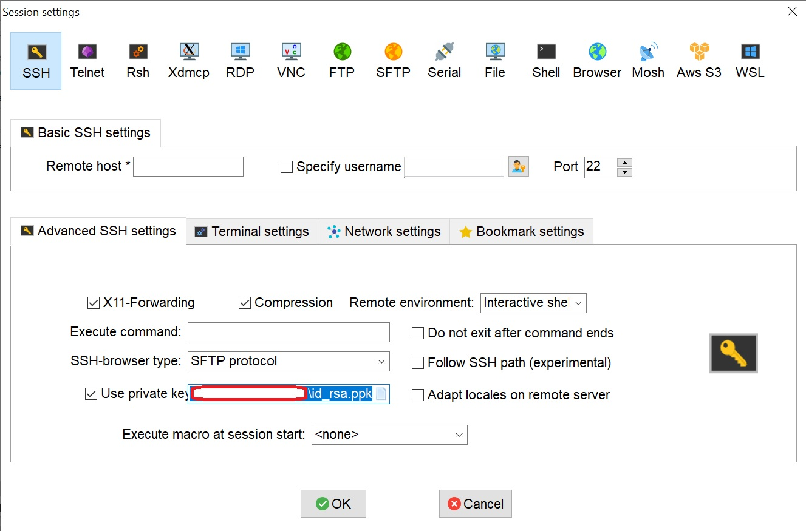  

## Step 2: Install WebLogic Binary on the first VM

Follow installation guide [here](weblogic_standalone_setup_on_oci.md)

## Step 3: Configure Cluster WebLogic Domain

### Run Domain Configuration Wizard

Start Domain Configuration Wizard from SSH from /home/opc/Oracle/Middleware/Oracle_Home/oracle_common/common/bin by running './config.sh':  

  

Select create new domain and change the default domain name to your preferred domain name. In this example, we are using 'clusterDomain' as shown. Click 'Next' to proceed:  

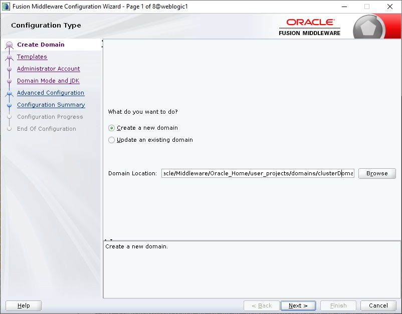  

Click 'Next' to proceed:

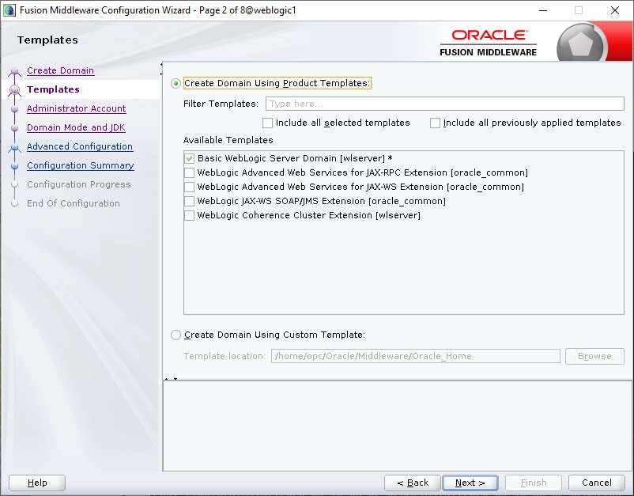  

Enter admin user name, password and click 'Next':  

  

For optimal performance, choose 'Production' mode and default JDK, click 'Next':  

  

Click on the checkbox next to 'Topology' in order to configure cluster, and click 'Next':  

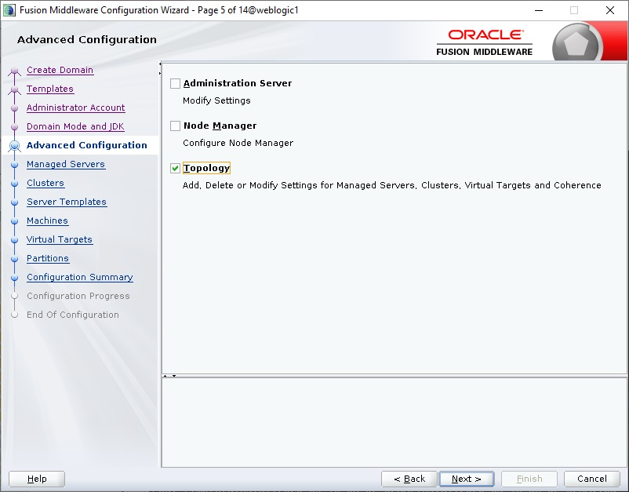  

Click 'Add' button twice to create two managed server, and configure its names as ms1 and ms2 respectively. In ms1, use the dropdown to pick the local IP within OCI as listen address, while for ms2, manually enter a similar IP temporary as we don't have the new IP yet for second compute. Set port number for both server as 7003, and click 'Next':  

  

Click 'Add' button to create a new cluster and enter name as 'demoCluster', and click 'Next':  

  

Click 'Next':  

  

Click 'Next' as we are not using dynamic cluster for this setup:  

  

Click on 'ms1'/'ms2' on the left and select 'demoCluster' on the right, the right arrow button will be enabled. Click on the right arrow to add both ms1 and ms2 into the cluster as shown, and click 'Next':  

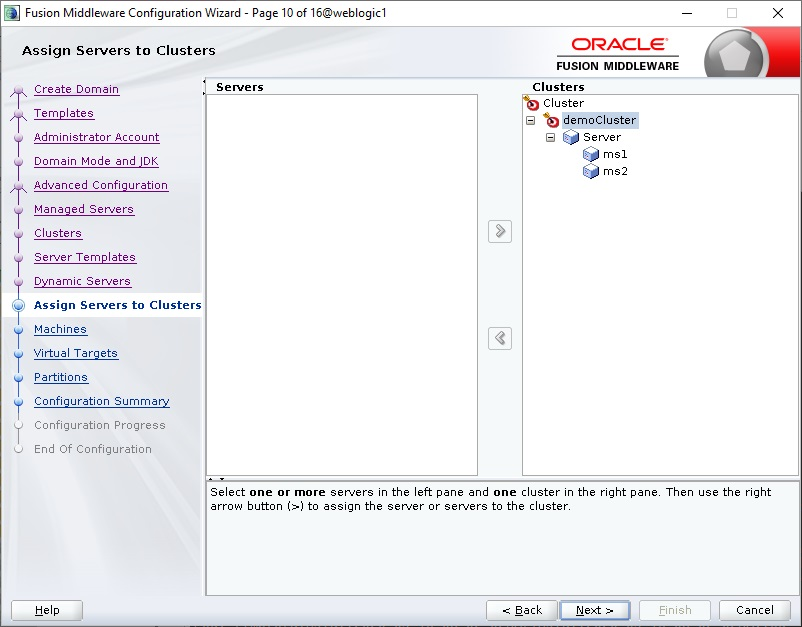  

Click on "Unix Machine" and use the 'Add' button to add two machines as shown, and click 'Next':  

  

Use the arrow to move the servers from left to right under machine1 and machine2 as shown:  

  

In summary screen, click 'Create' to proceed with domain creation:  

  

Upon completion, click 'Next' to proceed:  

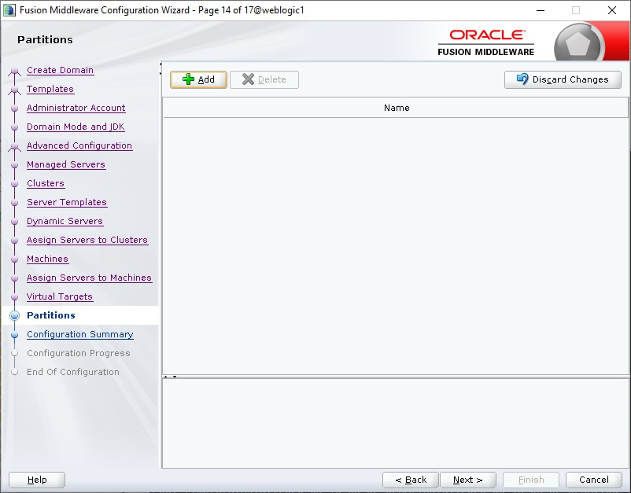  

Click 'Finish' to exit the wizard.  

  

### Open Firewall for Port 7001

In order to access the admin console remotely, we need to open up firewall for port 7001 (admin server). Should you need to access the managed servers too, you need to use the same procedure to open port 7003.  

From SSH, run this:  

- sudo firewall-cmd --permanent --zone=public --add-port=7001/tcp  
- sudo firewall-cmd --reload  

  

From OCI Cloud Console showing details of the compute weblogic1, click on the subnet name as shown:  

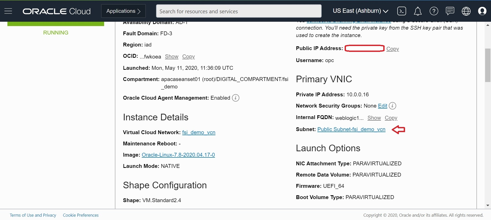  

In the subnet details page, scroll down and click on the name of the default security list as shown:  

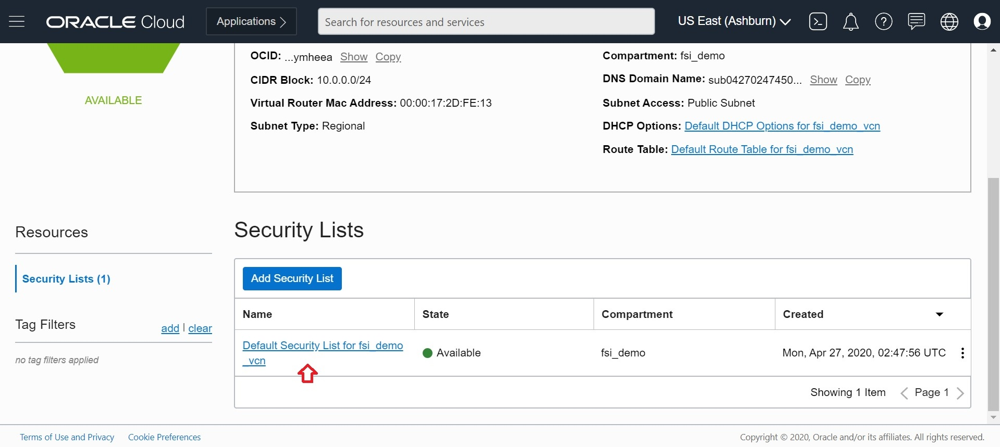  

Click on 'Add Ingress Rule':  

  

Enter source CIDR as '0.0.0.0/0' and destination port as '7001', and click 'Add Ingress Rules'. This will add rule in the subnet to allow public Internet to have access to port 7001 to all servers within the subnet.  

  

### Start WebLogic Server

- From SSH, change working directory to domain home: cd /home/opc/Oracle/Middleware/Oracle_Home/user_projects/domains/clusterDomain  
- Create a defaut login credential by creating a directory structure from domain home:  
mkdir servers  
cd servers  
mkdir AdminServer  
cd AdminServer  
mkdir security  
cd security

  

- Create a new file boot.properties by running: vi boot.properties  

File content should be as follows:  

username=weblogic  
password=\<selected password during domain configuration wizard\>  

- Change working directory to <Domain_home>/bin  
- Start Admin server with the command: nohup ./startWebLogic.sh > admin.log &  

  

- To track the progress, run: tail -f admin.log and wait till you see this message below, this indicate WebLogic Admin Server is up:  

  

- To access the admin server from browser, open browser with the URL: http://<public_ip>:7001/console  

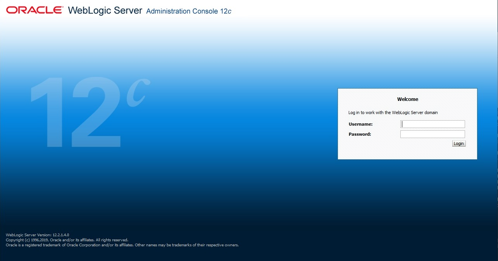  

This shows WebLogic Server is now up and running.  

To start the first managed server, follow the similar steps above to create the same boot.properties file under <domain_home>/servers/ms1/security, and run the start script from <domain_home>/bin: nohup ./startManagedWebLogic ms1 localhost:7001 > server1.log &  

Monitor the log server1.log to make sure ms1 is up. You can see this from WebLogic Console:  

  

## Step 4: Configure Node Manager for First VM
## Step 5: Clone Boot Volume of First VM into Second VM
## Step 6: Provision Second VM weblogic2
## Step 7: Prepare Second VM to join WebLogic Cluster
## Step 8: Bring Up and Test WebLogic Cluster
