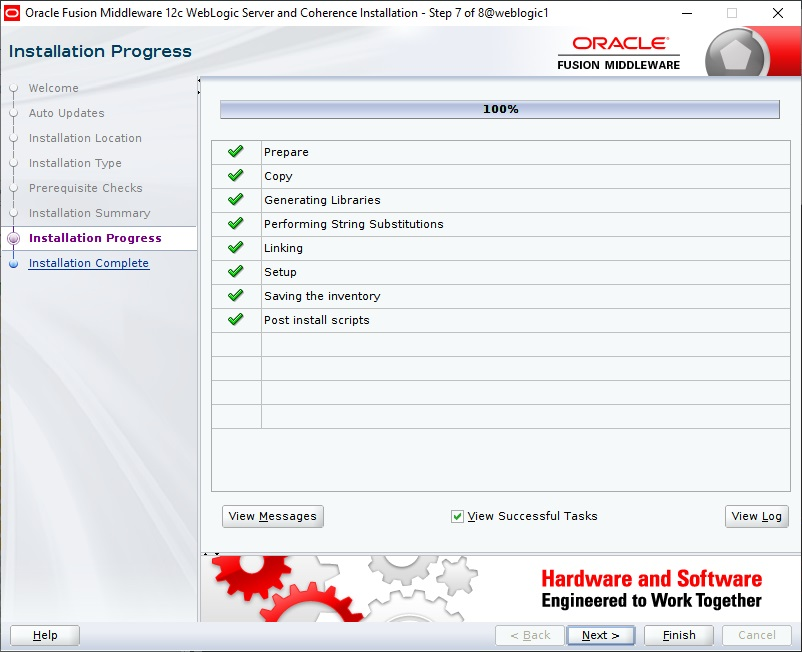

# Oracle WebLogic Server Installation on OCI Guide

## Pre-requisite

This guide assumes you have already provisioned OEL Compute on OCI and have SSH access to the environment. For optimal experience running the installer, provision a Windows compute within the same OCI subnet and run MobaTerm within the Windows server, it's a lot faster

## Step 1: Download WebLogic Server Binary

- Secure Shell into OCI compute and login as opc, you should not need to enter password since we are using the generated private key
- Create a new directory under opc home called 'install', this folder should be accessable from /home/opc/install. (mkdir install)  
```
cd
mkdir install
```
- Download the generic installer for the desired WebLogic Server from https://www.oracle.com/middleware/technologies/fusionmiddleware-downloads.html, and put the file fmw_12.2.1.4.0_wls_Disk1_1of1.zip into the install folder as shown below:  
```
cd
cd install
ls
```
This will show the content of install dir whhere WebLogic installer that has just been uploaded located:
```
fmw_12.2.1.4.0_wls_Disk1_1of1.zip
```
## Step 2: Install Java

You can check the available JDK with the command:
```
sudo yum list jdk*
```
A sample output is as follows:  
```
Loaded plugins: langpacks, ulninfo
ol7_UEKR5                                                | 2.8 kB     00:00
ol7_addons                                               | 2.8 kB     00:00
ol7_developer                                            | 2.8 kB     00:00
ol7_developer_EPEL                                       | 3.4 kB     00:00
ol7_ksplice                                              | 2.8 kB     00:00
ol7_latest                                               | 3.4 kB     00:00
ol7_oci_included                                         | 2.9 kB     00:00
ol7_optional_latest                                      | 2.8 kB     00:00
ol7_software_collections                                 | 2.8 kB     00:00
(1/19): ol7_UEKR5/x86_64/updateinfo                        |  53 kB   00:00
(2/19): ol7_developer/x86_64/primary_db                    | 526 kB   00:00
(3/19): ol7_addons/x86_64/primary_db                       | 149 kB   00:00
(4/19): ol7_developer_EPEL/x86_64/updateinfo               | 6.1 kB   00:00
(5/19): ol7_developer_EPEL/x86_64/group_gz                 |  87 kB   00:00
(6/19): ol7_developer/x86_64/updateinfo                    | 7.2 kB   00:00
(7/19): ol7_ksplice/updateinfo                             | 5.3 kB   00:00
(8/19): ol7_UEKR5/x86_64/primary_db                        | 5.5 MB   00:00
(9/19): ol7_latest/x86_64/group_gz                         | 134 kB   00:00
(10/19): ol7_ksplice/primary_db                            | 821 kB   00:00
(11/19): ol7_addons/x86_64/updateinfo                      |  89 kB   00:00
(12/19): ol7_latest/x86_64/updateinfo                      | 2.8 MB   00:00
(13/19): ol7_oci_included/x86_64/primary_db                | 163 kB   00:00
(14/19): ol7_optional_latest/x86_64/primary_db             | 4.7 MB   00:00
(15/19): ol7_software_collections/x86_64/updateinfo        | 8.7 kB   00:00
(16/19): ol7_software_collections/x86_64/primary_db        | 4.8 MB   00:00
(17/19): ol7_latest/x86_64/primary_db                      |  22 MB   00:00
(18/19): ol7_optional_latest/x86_64/updateinfo             | 1.0 MB   00:00
(19/19): ol7_developer_EPEL/x86_64/primary_db              |  12 MB   00:01
Available Packages
jdk-11.0.3.x86_64              2000:11.0.3-ga                   ol7_oci_included
jdk-11.0.4.x86_64              2000:11.0.4-ga                   ol7_oci_included
jdk-11.0.5.x86_64              2000:11.0.5-ga                   ol7_oci_included
jdk-11.0.7.x86_64              2000:11.0.7-ga                   ol7_oci_included
jdk-12.0.1.x86_64              2000:12.0.1-ga                   ol7_oci_included
jdk-12.0.2.x86_64              2000:12.0.2-ga                   ol7_oci_included
jdk-13.x86_64                  2000:13-ga                       ol7_oci_included
jdk-13.0.1.x86_64              2000:13.0.1-ga                   ol7_oci_included
jdk-14.x86_64                  2000:14-ga                       ol7_oci_included
jdk-14.0.1.x86_64              2000:14.0.1-ga                   ol7_oci_included
jdk1.8.x86_64                  2000:1.8.0_251-fcs               ol7_oci_included
```
We will install JDK 8 here, run the command: 
```
sudo yum install jdk1.8.x86_64 -y  
```
The expected result will be:
```
Loaded plugins: langpacks, ulninfo
Resolving Dependencies
--> Running transaction check
---> Package jdk1.8.x86_64 2000:1.8.0_251-fcs will be installed
--> Finished Dependency Resolution

Dependencies Resolved

================================================================================
 Package     Arch        Version                    Repository             Size
================================================================================
Installing:
 jdk1.8      x86_64      2000:1.8.0_251-fcs         ol7_oci_included      171 M

Transaction Summary
================================================================================
Install  1 Package

Total download size: 171 M
Installed size: 296 M
Downloading packages:
jdk-8u251-linux-x64.rpm                                    | 171 MB   00:03
Running transaction check
Running transaction test
Transaction test succeeded
Running transaction
  Installing : 2000:jdk1.8-1.8.0_251-fcs.x86_64                             1/1
Unpacking JAR files...
        tools.jar...
        plugin.jar...
        javaws.jar...
        deploy.jar...
        rt.jar...
        jsse.jar...
        charsets.jar...
        localedata.jar...
  Verifying  : 2000:jdk1.8-1.8.0_251-fcs.x86_64                             1/1

Installed:
  jdk1.8.x86_64 2000:1.8.0_251-fcs

Complete!
```
Once installation complete, you can verify the Java version by running: java -version  

You should be able to see the follow  
```
java version "1.8.0_251"
Java(TM) SE Runtime Environment (build 1.8.0_251-b08)
Java HotSpot(TM) 64-Bit Server VM (build 25.251-b08, mixed mode)
```
## Step 3: Export Display from OCI

Refer to [here](enable_display_in_oci.md)  

## Step 4: Extract WebLogic Installer

From install folder, run command: 
```
unzip fmw_12.2.1.4.0_wls_Disk1_1of1.zip  
```
The expected result will be:
```
Archive:  fmw_12.2.1.4.0_wls_Disk1_1of1.zip
  inflating: fmw_12.2.1.4.0_wls.jar
  inflating: fmw_12214_readme.html
```
Run the install by running command: 
```
java -jar fmw_14.1.1.0.0_wls.jar  
```
You should see the follow with Invetory directory in /home/opc/oraInventory:

  

And click on OK:  

  

Skip auto update and click 'Next':  

  

Accept default home and click 'Next':   

  

Accept default installation choice and click 'Next'.

  

Pre-Installation check will start now. Please wait for it to complete:  


Click 'Next' and 'Install' from Summary screen to start the installation process and wait for it to complete: 

  

Click on 'Finish' to complete the installation. 

  

Now you have WebLogic installed on OCI. You can now proceed to create new domains with Domain Configuration Wizard.  
